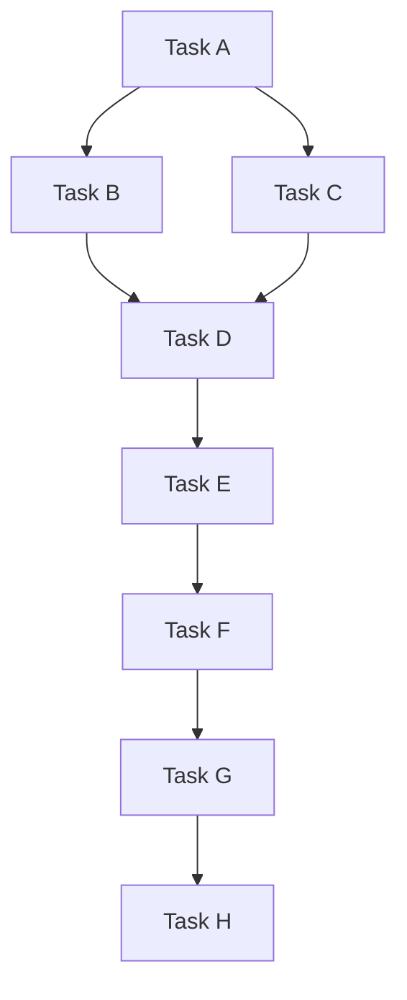

# tokio-mpsc-task-test
Simple Task Test with Tokio MPSC

## Example Execution



```json
{"timestamp":"2024-12-08T20:42:10.268285Z","level":"INFO","fields":{"message":"Task A started"},"filename":"src/main.rs","line_number":55}
{"timestamp":"2024-12-08T20:42:10.268318Z","level":"INFO","fields":{"message":"Waiting for dependencies of Task D..."},"filename":"src/main.rs","line_number":108}
{"timestamp":"2024-12-08T20:42:10.268315Z","level":"INFO","fields":{"message":"Waiting for dependencies of Task C..."},"filename":"src/main.rs","line_number":108}
{"timestamp":"2024-12-08T20:42:10.268331Z","level":"INFO","fields":{"message":"Waiting for dependencies of Task B..."},"filename":"src/main.rs","line_number":108}
{"timestamp":"2024-12-08T20:42:10.268339Z","level":"INFO","fields":{"message":"Waiting for dependencies of Task E..."},"filename":"src/main.rs","line_number":108}
{"timestamp":"2024-12-08T20:42:10.268349Z","level":"INFO","fields":{"message":"Waiting for dependencies of Task G..."},"filename":"src/main.rs","line_number":108}
{"timestamp":"2024-12-08T20:42:10.268344Z","level":"INFO","fields":{"message":"Waiting for dependencies of Task F..."},"filename":"src/main.rs","line_number":108}
{"timestamp":"2024-12-08T20:42:11.269600Z","level":"INFO","fields":{"message":"Task A completed. Notifying dependents"},"filename":"src/main.rs","line_number":90}
{"timestamp":"2024-12-08T20:42:11.269768Z","level":"INFO","fields":{"message":"Notifying Task B"},"filename":"src/main.rs","line_number":98}
{"timestamp":"2024-12-08T20:42:11.269855Z","level":"INFO","fields":{"message":"Notifying Task C"},"filename":"src/main.rs","line_number":98}
{"timestamp":"2024-12-08T20:42:11.270141Z","level":"INFO","fields":{"message":"Dependency completed for Task C"},"filename":"src/main.rs","line_number":110}
{"timestamp":"2024-12-08T20:42:11.270226Z","level":"INFO","fields":{"message":"Task C started"},"filename":"src/main.rs","line_number":55}
{"timestamp":"2024-12-08T20:42:11.270424Z","level":"INFO","fields":{"message":"Dependency completed for Task B"},"filename":"src/main.rs","line_number":110}
{"timestamp":"2024-12-08T20:42:11.270727Z","level":"INFO","fields":{"message":"Task B started"},"filename":"src/main.rs","line_number":55}
{"timestamp":"2024-12-08T20:42:12.271644Z","level":"INFO","fields":{"message":"Task C completed. Notifying dependents"},"filename":"src/main.rs","line_number":90}
{"timestamp":"2024-12-08T20:42:12.271805Z","level":"INFO","fields":{"message":"Notifying Task D"},"filename":"src/main.rs","line_number":98}
{"timestamp":"2024-12-08T20:42:12.271913Z","level":"INFO","fields":{"message":"Dependency completed for Task D"},"filename":"src/main.rs","line_number":110}
{"timestamp":"2024-12-08T20:42:12.271981Z","level":"INFO","fields":{"message":"Task D started"},"filename":"src/main.rs","line_number":55}
{"timestamp":"2024-12-08T20:42:12.272201Z","level":"INFO","fields":{"message":"Task B completed. Notifying dependents"},"filename":"src/main.rs","line_number":90}
{"timestamp":"2024-12-08T20:42:13.273479Z","level":"INFO","fields":{"message":"Task D completed. Notifying dependents"},"filename":"src/main.rs","line_number":90}
{"timestamp":"2024-12-08T20:42:13.273645Z","level":"INFO","fields":{"message":"Notifying Task E"},"filename":"src/main.rs","line_number":98}
{"timestamp":"2024-12-08T20:42:13.273764Z","level":"INFO","fields":{"message":"Dependency completed for Task E"},"filename":"src/main.rs","line_number":110}
{"timestamp":"2024-12-08T20:42:13.273839Z","level":"INFO","fields":{"message":"Task E started"},"filename":"src/main.rs","line_number":55}
{"timestamp":"2024-12-08T20:42:14.275574Z","level":"INFO","fields":{"message":"Task E completed. Notifying dependents"},"filename":"src/main.rs","line_number":90}
{"timestamp":"2024-12-08T20:42:14.275741Z","level":"INFO","fields":{"message":"Notifying Task F"},"filename":"src/main.rs","line_number":98}
{"timestamp":"2024-12-08T20:42:14.276062Z","level":"INFO","fields":{"message":"Dependency completed for Task F"},"filename":"src/main.rs","line_number":110}
{"timestamp":"2024-12-08T20:42:14.276143Z","level":"INFO","fields":{"message":"Task F started"},"filename":"src/main.rs","line_number":55}
{"timestamp":"2024-12-08T20:42:15.277481Z","level":"INFO","fields":{"message":"Task F completed. Notifying dependents"},"filename":"src/main.rs","line_number":90}
{"timestamp":"2024-12-08T20:42:15.277606Z","level":"INFO","fields":{"message":"Notifying Task G"},"filename":"src/main.rs","line_number":98}
{"timestamp":"2024-12-08T20:42:15.277688Z","level":"INFO","fields":{"message":"Dependency completed for Task G"},"filename":"src/main.rs","line_number":110}
{"timestamp":"2024-12-08T20:42:15.277734Z","level":"INFO","fields":{"message":"Task G started"},"filename":"src/main.rs","line_number":55}
{"timestamp":"2024-12-08T20:42:16.279482Z","level":"INFO","fields":{"message":"Task G completed. Notifying dependents"},"filename":"src/main.rs","line_number":90}
{"timestamp":"2024-12-08T20:42:16.279922Z","level":"INFO","fields":{"message":"All tasks completed."},"filename":"src/main.rs","line_number":81}
```